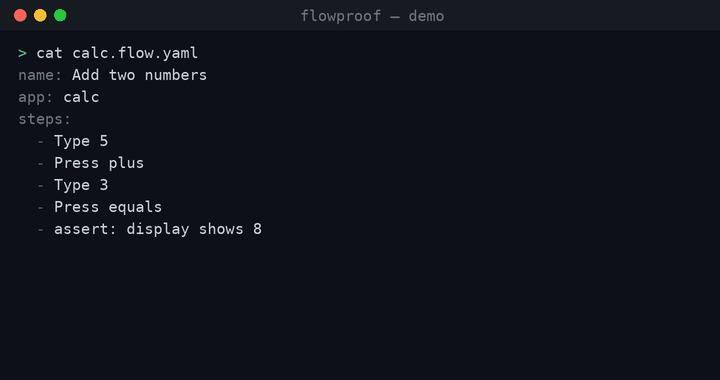

# flowproof

[](https://github.com/automators-com/flowproof/actions/workflows/ci.yml)
[](https://pypi.org/project/flowproof/)
[](LICENSE)

A generic open-source automation framework for the AI-agent era:
**automated testing and agentic process automation** across web, desktop,
and Citrix. Agents author flows from natural-language intent; a
deterministic engine executes them. Humans shift from authoring to
reviewing.



## How it works

**Agents author, a deterministic engine executes.** An agent performs a
flow once from a natural-language YAML spec and records a **trace** — the
resolved selectors, actions, and assertions. The trace replays
deterministically in CI with **zero LLM calls**. When the app changes and
a step breaks, healing proposes a reviewable diff — never a silent
mutation.

flowproof is built **agent-native**: the primary caller is a program
(usually an AI agent), with humans in an oversight role. Every operation
is a library call returning structured results — including a structured
"here is what I'd need to know" payload when a step is too ambiguous to
author. The CLI and [MCP server](docs/self-help.md) are thin renderings
over the same code paths.

Open-source automation has moved in steps: Selenium made browsers
scriptable, Playwright made web automation reliable, Robot Framework
widened automation beyond the browser to acceptance testing and RPA.
flowproof is built for the next step — the era in which AI agents write
and maintain the automation, and what matters is that their output is
**deterministic to execute and cheap to review**.

## Quick start

```bash
pip install flowproof
```

Write a spec — natural-language steps, no selectors:

```yaml
# calc.flow.yaml
name: Add two numbers
app: calc
steps:
  - Type 5
  - Press plus
  - Type 3
  - Press equals
  - assert: display shows 8
```

Record once, replay forever:

```bash
flowproof record calc.flow.yaml   # performs the flow live, writes calc.trace.jsonl
flowproof run calc.flow.yaml      # deterministic replay: per-step PASS/FAIL, exit 0/1
```

The Calculator walkthrough needs a Windows desktop; on any OS, point
`app: web` at a page instead (see [examples/](examples/)) or use
`app: api` for flows with no UI at all. Add `--json` for the full
structured report on stdout. [docs/getting-started.md](docs/getting-started.md)
is the complete walkthrough.

## Python API

```python
from flowproof import Flow

flow = Flow("calc.flow.yaml")
flow.record()                    # RecordResult(trace_path=..., steps=5)

result = flow.run()              # RunResult — truthy iff the flow passed
result.steps[4].status           # "passed"
result.report_path               # result.json artifact for this run

trace = flow.get_trace()         # inspect the recorded trace programmatically
```

Agents can drive the same four operations — record, run, get_trace, heal —
over MCP: `pip install flowproof[mcp]`, run `flowproof-mcp`.

## What works today

**Author** — steps in plain language, resolved two ways:
- A deterministic rules grammar ([docs/authoring.md](docs/authoring.md) —
  every documented form is enforced by a test) covers the common
  vocabulary: type, click, select, navigate, wait, assert.
- For anything freeform, a model grounds the step against the live app's
  real elements via neutral target tokens — it can never invent a
  selector — and the result still replays with zero model calls.
  Anthropic or any OpenAI-compatible endpoint (vLLM).
- When a step is too ambiguous to author ("make required field changes"),
  recording returns a structured clarification payload — the stuck step
  plus the live screen's field inventory — so the driving agent can
  resolve the ambiguity and re-record ([docs/self-help.md](docs/self-help.md)).

**Execute** — deterministic replay with a provenance-tagged
[selector ladder](docs/trace-format.md) (native id → structural → text
anchor) that falls back rung by rung and flags degraded matches for
healing; auto-waiting assertions; `--retries` for infra flakes. Point
`run` at a directory to execute a whole suite: one shared browser with an
isolated context per flow, a `suite.yaml` manifest for shared env,
seed/cleanup hooks, and data minted by an external CLI
(`env_from` → `${VAR}`).

**Review** — every run writes a bundle: `result.json`, JUnit XML,
an HTML report, and a trace-synced `recording.gif` so a human can watch
what the run actually did. `flowproof heal` re-authors a broken flow
against the live app and proposes a reviewable trace diff with
before/after frames — applied only with explicit `--apply`.

**Reach** — adapters behind one spec format:
- `app: web` — headless Chromium via DevTools protocol, cross-platform
- Windows desktop via UI Automation (`calc`, `notepad`)
- `app: sap` — SAP GUI Scripting over COM: native scripting ids,
  transaction-code navigation (`Go to /nVA01`), SAP virtual keys; an
  in-memory fake engine keeps the pipeline tested on every platform
- `app: vision` — pixels-only driving for Citrix/RDP: OCR perception
  (pure-Rust ocrs), spatial text anchors, real input injection
- `app: api` — no UI at all: flows made of HTTP and SQL assertions

**Verify beyond the UI** — out-of-band truth in any flow: `assert_sql`
(postgres) and `assert_api` (status, body matching, JSON request body,
auth headers). Secrets travel as `${VAR}` references: resolved from the
environment when the step fires, never stored in a trace; password
fields are masked in captured frames.

All of it ships as one wheel (PyO3/maturin): Rust engine, Python API,
CLI, MCP server. Proven in CI on every push: a Notepad flow records and
replays on GitHub's Windows runners, the web adapter drives real Chromium
on Linux, the SAP pipeline runs against the fake engine, and vision runs
real OCR over synthetic screens.

## Architecture

```
spec (natural language, YAML)
   │  flowproof record          ← agent authors: rules first, model fallback,
   ▼                              grounded against the live app
trace (JSON-lines, versioned)  ← selectors + actions + assertions, ${VAR} refs
   │  flowproof run             ← deterministic, zero LLM calls
   ▼
run bundle                     ← result.json · junit.xml · report.html ·
                                 recording.gif · healing diffs on drift
```

| Path | What it is |
| --- | --- |
| `crates/flowproof-driver` | Screen/input/UIA driver + out-of-band probes |
| `crates/flowproof-trace` | Trace format, selector ladder, secret indirection, JSON Schema |
| `crates/flowproof-replay` | Deterministic executor + run reports |
| `crates/flowproof-agent` | Spec parsing, rules + model authoring, recorder, healing |
| `crates/flowproof-adapters` | Web (CDP), SAP GUI COM, vision adapters |
| `crates/flowproof-cli` | `flowproof` CLI (thin wrapper over the library) |
| `sdk/python` | The `flowproof` Python package (bundles the engine + MCP server) |

## Status

Early, in active development. v0.2 on PyPI. The record→replay spine, all
five adapters, healing, suites, and the MCP surface are real and tested in
CI; interfaces may still change between minor versions.

**Choosing between flowproof and an existing browser-automation suite?**
[docs/comparison.md](docs/comparison.md) is an honest read on when
flowproof fits and when to keep what you have.

## Roadmap

Planned, not yet shipped — feature bullets above only claim what works:

- Network interception/mocking for web flows
- Failure debug bundle (DOM snapshot, console tail, nearest-anchor hints)
- Incremental re-record: re-author only drifted steps
- npm distribution of the CLI (the wheel stays the primary SDK)
- Visual-template matching, OCR sync conditions, DXGI capture for vision
- Healing over the clarification-payload surface; worker parallelism

See [docs/design.md](docs/design.md) for the design notes behind these.

## Contributing

See [CONTRIBUTING.md](CONTRIBUTING.md). Licensed under
[Apache-2.0](LICENSE).
