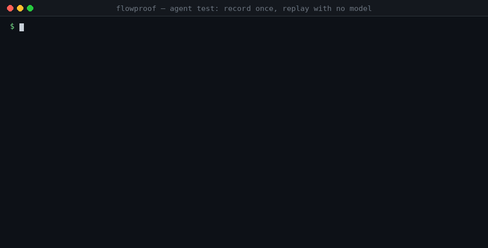

# flowproof

[](https://github.com/automators-com/flowproof/actions/workflows/ci.yml)
[](https://pypi.org/project/flowproof/)
[](https://www.npmjs.com/package/flowproof)
[](LICENSE)

## Your bot behaved today. Prove it'll behave tomorrow.

Software robots already do real work in production. They raise orders in SAP,
update records, close tickets — jobs a person used to do by hand, and jobs
agents are taking over more of every month. flowproof is how you test that one
of them only ever does the job it was given, and never deletes, sends or
approves the thing it must not.

Record the bot doing its job once. After that, every commit runs that
recording again and checks it — no model, no API key, nothing billed. Name the
lines it must never cross, and the build breaks the instant one is crossed.
Not a suite you hope still passes. Evidence, every push.

Everywhere your bots work: web, desktop, SAP, Citrix.



One spec, one `record` against a real model, then `run` forever with none. The
frames are a capture of [`scripts/demo/`](scripts/demo/) actually running, not a
mock-up. The same three commands carry the guard path — add
`assert_no_tool_call` and the call an agent must *never* make is proven on every
commit ([docs/agent-testing.md](docs/agent-testing.md)).

## The same promise, precisely

A rule the bot has to obey — never refund without approval, never delete a
customer — is what flowproof calls a **control**, and its job is to keep
proving that control still holds.

Record your agent's real run once: every model request and every tool-call
decision it made. From then on, replay it with **zero LLM calls** and assert
what matters — which tools were called, with which arguments, and which were
**never** called. `flowproof audit --since` exits non-zero the moment a control
starts failing or quietly stops being checked, so a guarantee you made last
month is re-proved on every commit instead of being remembered.

The same spec format drives web, Windows, SAP GUI, Citrix and HTTP. A bot can
go wrong in two places — what it decided to do, and what it actually did to
your system — and one recording covers both. An agent that files an SAP order
is one job to get right, not two.

**Three verbs, three mechanisms, and they are not equally strong.** Worth
knowing which one is holding a given line, because the answer decides what a
green build actually proves:

| The claim | Backed by | What it is |
|---|---|---|
| never **approves** | `assert_no_tool_call` | the agent did not ask for the call, on any platform |
| never **deletes** | `assert_no_tool_call` | same, when the delete goes through a tool — which is how an agent deletes a customer |
| never **sends** | `assert_no_egress` | a real seccomp filter refused it, on Linux; the step fails outright anywhere it cannot be enforced, rather than passing vacuously |

What is *not* asserted: a file the agent's own process destroys directly. On
Linux that is now **reported** — the run prints what it unlinked, renamed or
truncated — but a report is not a control, and no build breaks on one. See
[docs/agent-testing.md](docs/agent-testing.md#filesystem-observation).

Flows are plain YAML - short enough for an agent to write, readable enough
for a human to review in a diff.

Adding it to an existing agent? [docs/adopting.md](docs/adopting.md) is
written to be handed to a coding agent.

Product page: [automators.ai/flowproof](https://automators.ai/flowproof)

## How it works

**Agents author, a deterministic engine executes.** An agent performs a
flow once from a natural-language YAML spec and records a **trace** — the
resolved selectors, actions, and assertions. The trace replays
deterministically in CI with **zero LLM calls**. When the app changes and
a step breaks, healing proposes a reviewable diff — never a silent
mutation.

flowproof is built **agent-native**: the primary caller is a program
(usually an AI agent), with humans in an oversight role. Every operation
is a library call returning structured results — including a structured
"here is what I'd need to know" payload when a step is too ambiguous to
author. The CLI and [MCP server](docs/self-help.md) are thin renderings
over the same code paths.

Open-source automation has moved in steps: Selenium made browsers
scriptable, Robot Framework widened automation beyond the browser to
acceptance testing and RPA, Playwright made web automation reliable.
flowproof is built for the next step — the era in which AI agents write
and maintain the automation, and what matters is that their output is
**deterministic to execute and cheap to review**.

<picture>
  <source media="(prefers-color-scheme: dark)" srcset="docs/assets/lineage-dark.svg">
  
</picture>

## Two kinds of claim, and the difference matters

flowproof makes two sorts of guarantee, and it is worth being blunt about
which is which.

**Containment claims — "it cannot."** Declare an agent's allowed network
with `allow_egress` and certify it with `assert_no_egress`, and on Linux
the agent runs under an unprivileged default-deny seccomp filter:
undeclared destinations are refused by the kernel. Declare a tool under
`mcp:` with a `result:` and flowproof answers it as the server — the real
tool never executes, in either phase. These hold regardless of what the
model decides, because a mechanism enforces them rather than an
instruction. On macOS and Windows containment is not enforced, and the run
reports "not contained" rather than passing vacuously.

**Behaviour claims — "it did not, and it is re-checked on every change."**
`assert_no_tool_call` proves the agent did not request a forbidden tool
given the recorded model response, and the cassette pins every argument
byte-exactly, so drift you never thought to assert still fails. This is
regression evidence, not proof of impossibility: a model that behaved on
the day you recorded is not a model that always will.

A guard flow is strongest when it is paired with enforcement, and when the
recording contains a model that genuinely tried. If the only thing between
a user and a destructive call is a sentence in a system prompt, that is not
a control — and flowproof's job is to make that visible, not to paper over
it ([docs/agent-testing.md](docs/agent-testing.md#making-a-guard-flow-prove-enforcement-not-compliance)).

## Quick start

```bash
npx flowproof --version      # no install, no Python
```

```bash
npm install --save-dev flowproof
# or: pip install flowproof
```

A spec is natural-language steps and no selectors. This one tests an agent —
a real one, built on the official OpenAI SDK, shipped in
[`examples/agent-demo/`](examples/agent-demo/):

```yaml
# examples/agent-demo/weather-node.flow.yaml
name: Weather assistant answers with the forecast (Node)
app: agent
agent:
  command: node examples/agent-demo/weather_agent.mjs
tools:
  - name: get_weather
    result: { city: Nairobi, sky: sunny, temp_c: 26 }
steps:
  - prompt: What is the weather in Nairobi right now? Use your tools.
  - assert_tool_call: get_weather where city contains Nairobi
  - assert: reply contains sunny
```

**Record once.** The only step that calls a real model, so the only one that
needs a key:

```bash
npm install openai
export ANTHROPIC_API_KEY=...        # or OPENAI_API_KEY
npx flowproof record examples/agent-demo/weather-node.flow.yaml
```

**Replay for ever.** No key, no model, no network to the provider:

```bash
npx flowproof run examples/agent-demo/weather-node.flow.yaml
```

The agent ran for real both times — same client, same tool loop. At record
flowproof captured the exchange at the model boundary; at replay it served
that recording back, so the trajectory is fixed and nothing was billed.
`assert_tool_call` is the part that fails when the agent regresses: wrong
tool, wrong argument, or a tool called out of order.

Want a green run before you have a key? The GIF's cassette is committed, so
`pip install openai && flowproof run scripts/demo/order-status.flow.yaml`
passes on a fresh clone — no key, no provider network.

Any OS. For a UI instead of an agent, point `app: web` at a page, or `app: api`
at a flow with no UI at all ([examples/](examples/)); the Windows Calculator
walkthrough lives in [docs/getting-started.md](docs/getting-started.md), which
is the complete version of this section. Add `--json` for the structured
report on stdout.

## Python API

```python
from flowproof import Flow

flow = Flow("calc.flow.yaml")
flow.record()                    # RecordResult(..., routing=({"route": "llm", ...},))

result = flow.run()              # RunResult — truthy iff the flow passed
result.steps[4].status           # "passed"
result.report_path               # result.json artifact for this run

trace = flow.get_trace()         # inspect the recorded trace programmatically
```

Agents can drive the same four operations — record, run, get_trace, heal —
over MCP: `pip install flowproof[mcp]`, run `flowproof-mcp`.

## What works today

**Author** — plain scalar steps are human intent: a model grounds them
against the live app's real elements via neutral target tokens, and the
result replays with zero model calls. It cannot invent selectors. Use
`rules: <text>` for one deterministic step or `--author rules` for an
entire flow; the complete grammar is in
[docs/authoring.md](docs/authoring.md), with every documented form enforced
by a test. Anthropic and OpenAI-compatible endpoints (including vLLM) are
supported.
- When a step is too ambiguous to author ("make required field changes"),
  recording returns a structured clarification payload — the stuck step
  plus the live screen's field inventory — so the driving agent can
  resolve the ambiguity and re-record ([docs/self-help.md](docs/self-help.md)).

**Execute** — deterministic replay with a provenance-tagged
[selector ladder](docs/trace-format.md) (native id → structural → text
anchor) that falls back rung by rung and flags degraded matches for
healing; auto-waiting assertions; `--retries` for infra flakes. Point
`run` at a directory to execute a whole suite: one shared browser with an
isolated context per flow, a `suite.yaml` manifest for shared env,
seed/cleanup hooks, and data minted by an external CLI
(`env_from` → `${VAR}`).

**Review** — every run writes a bundle: `result.json`, JUnit XML,
an HTML report, and a trace-synced `recording.gif` so a human can watch
what the run actually did. `flowproof heal` re-authors a broken flow
against the live app and proposes a reviewable trace diff with
before/after frames — applied only with explicit `--apply`.

**Reach** — adapters behind one spec format:
- `app: web` — Chromium via DevTools protocol, cross-platform; headless by
  default, `FLOWPROOF_HEADED=1` to watch it
- Windows desktop via UI Automation (`calc`, `notepad`)
- `app: sap` — SAP GUI Scripting over COM: native scripting ids,
  transaction-code navigation (`Go to /nVA01`), SAP virtual keys; an
  in-memory fake engine keeps the pipeline tested on every platform
- `app: vision` — pixels-only driving for Citrix/RDP: OCR perception
  (pure-Rust ocrs), spatial text anchors, real input injection
- `app: api` — no UI at all: flows made of HTTP and SQL assertions
- `app: agent`: test an AI agent at the model boundary. Record its
  trajectory once against a real model, replay it deterministically with
  zero model calls, and assert the tool calls it makes
  ([docs/agent-testing.md](docs/agent-testing.md)). On **Linux**, an
  `agent.command` flow can be run under real, unprivileged **egress
  containment (seccomp)**: declare its network with `allow_egress` and
  certify it with `assert_no_egress`

**Verify beyond the UI** — out-of-band truth in any flow: `assert_sql`
(postgres) and `assert_api` (status, body matching, JSON request body,
auth headers); and for an `app: agent` flow, `assert_tool_call` /
`assert_no_tool_call` over the agent's trajectory. Secrets travel as
`${VAR}` references: resolved from the environment when the step fires,
never stored in a trace; password fields are masked in captured frames.

**Prove security controls hold**: a control is just a property that must
hold, asserted deterministically over a recorded flow. Name one with a
stable `control:` id; assert an access-control denial as a composed pattern
(become a low-privilege identity from the suite's `identities:`, prove it is
alive, then assert the denial); catch a leaked secret in agent output with
`assert_no_secret_leak: ${VAR}` (agent flows in v1); and fold the
control-bearing flows into a `pass`/`fail`/`capability-error` coverage map
with `flowproof audit`
([docs/authoring.md](docs/authoring.md#security-controls)).

**Debug what a tool sends**: `flowproof capture` is a byte-fidelity HTTP
capture endpoint: point a tool-under-test at it and every request is printed
and saved verbatim (method, path, all headers, raw body as text and hexdump,
plus any SAP `/BA1/`-style namespace field names), answered 200 so the send
side completes. It ships inside the flowproof binary, so it is one command to
run ([docs/capture.md](docs/capture.md)).

All of it ships as one wheel (PyO3/maturin): Rust engine, Python API,
CLI, MCP server. Proven in CI on every push: a Notepad flow records and
replays on GitHub's Windows runners, the web adapter drives real Chromium
on Linux, the SAP pipeline runs against the fake engine, and vision runs
real OCR over synthetic screens.

## Architecture

```
spec (natural language, YAML)
   │  flowproof record          ← model grounds plain human intent; explicit
   ▼                              `rules:` stays deterministic
trace (JSON-lines, versioned)  ← selectors + actions + assertions, ${VAR} refs
   │  flowproof run             ← deterministic, zero LLM calls
   ▼
run bundle                     ← result.json · junit.xml · report.html ·
                                 recording.gif · healing diffs on drift
```

| Path | What it is |
| --- | --- |
| `crates/flowproof-driver` | Screen/input/UIA driver + out-of-band probes |
| `crates/flowproof-trace` | Trace format, selector ladder, secret indirection, JSON Schema |
| `crates/flowproof-replay` | Deterministic executor + run reports |
| `crates/flowproof-agent` | Spec parsing, rules + model authoring, recorder, healing |
| `crates/flowproof-adapters` | Web (CDP), SAP GUI COM, vision adapters |
| `crates/flowproof-cli` | `flowproof` CLI (thin wrapper over the library) |
| `sdk/python` | The `flowproof` Python package (bundles the engine + MCP server) |

## Status

Early, in active development; interfaces may still change between minor
versions. The badges above carry the current release — the Rust crates, the
Python wheel and the npm package move together, so they are the same number.

Real and tested in CI: the record→replay spine, all six adapters (`web`,
Windows desktop, `sap`, `vision`, `api`, `agent`), model-grounded authoring,
healing with reviewable diffs, suites, the security-control surface
(`flowproof audit`), the MCP server, and — at the agent boundary — the
OpenAI-compatible proxy with `assert_tool_call`, the Anthropic Messages
dialect, streaming replay in both dialects, plus the MCP tool boundary over
stdio.

Built, but with thinner coverage: `agent.url` services and the MCP boundary
over streamable HTTP.
[docs/agent-testing.md](docs/agent-testing.md) names each gap in a
per-capability table rather than leaving "built" to imply "tested".

Two limits to know before you start: an agent flow is **one turn**, not a
conversation, and **egress containment is Linux-only** — elsewhere a
`command:` agent is reported "not contained" rather than silently trusted.

**Choosing between flowproof and an existing browser-automation suite?**
[docs/comparison.md](docs/comparison.md) is an honest read on when
flowproof fits and when to keep what you have.

## Contributing

See [CONTRIBUTING.md](CONTRIBUTING.md), and
[docs/design.md](docs/design.md) for the design notes behind the engine.
Licensed under [Apache-2.0](LICENSE).
