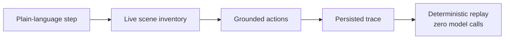

Use natural-language steps for user intent. Use `rules:` when the exact
deterministic action belongs in the source spec. Both routes produce the same
kind of trace, and replay makes zero model calls.

## Choose an authoring mode

| Mode | Use it when | How plain UI steps are authored |
| --- | --- | --- |
| `--author auto` | Recommended for most flows | Uses the configured model, or visibly falls back to rules when no model is configured |
| `--author llm` | Every plain step should use model grounding | Forces model authoring |
| `--author rules` | The whole flow already uses the deterministic grammar | Parses every plain step as a rule |

In the default `--author auto` mode, a plain scalar UI step expresses
natural-language intent:

```yaml
- Enter 24 Market Street in the shipping address field
```

`record` grounds that intent against the live scene. To opt one step into
the deterministic grammar instead, mark it explicitly:

```yaml
- rules: Type Ada into the "Full name" field
- rules: Press the "Save" button
```

An `assert:` that matches the deterministic grammar stays deterministic.
Other check wording becomes a read-only assertion in auto or LLM mode. The
model cannot change the page to satisfy a check. Structured forms such as
`assert_api:`, `repeat:`, and `when:` retain their own semantics in every mode.

If auto mode has no configured authoring model, recording says so visibly
and falls back to deterministic rules for plain steps. It never silently
reinterprets model intent. Human output identifies each step's route as
`rules`, `llm`, `reused`, or `fallback`, and structured/JSON output carries the
same per-step routing information for tooling. Consumers should use the
structured output rather than scraping the display text.

## Find the deterministic grammar

The authoring section is the complete rules grammar. These pages document the
text accepted inside `rules: <text>`, or as plain steps under global
`--author rules`:

| If you need to | Read |
| --- | --- |
| Click, type, select, scroll, drag, or press keys | [Actions](actions.md) |
| Check visible state, values, counts, or screenshots | [Assertions](assertions.md) |
| Reuse values within or between flows | [Variables and exports](variables-and-exports.md) |
| Repeat steps or branch on visible state | [Repeating and conditions](repeating.md) |
| Verify APIs, databases, or spreadsheets | [Out-of-band assertions](out-of-band-assertions.md) |
| Define security and audit controls | [Security controls](security-controls.md) |
| Diagnose a step that cannot be authored | [Troubleshooting](troubleshooting.md) |

Rules require no model call. Tests parse the documented examples through
`documented_grammar_examples_all_resolve` in
`crates/flowproof-agent/src/rules.rs`, so CI fails when code and grammar
examples drift.

## How model authoring becomes deterministic replay

Model authoring does not make replay probabilistic. The driver gives the
model a finite list of provenance-neutral scene tokens and accepts only
actions grounded to those listed tokens; the resulting selectors and
actions are persisted in the trace. Replay executes that trace directly,
with zero model calls.



### Grounding targets on the live surface

On the web, that inventory also represents readable values whose identity is
relational rather than global. A value cell in a div-based row may have no
unique id or class of its own, but still be stable as “the value beside `order
id`”. Flowproof exposes it to the model as one opaque `scoped:` token containing
a container, neighbouring text anchor, and inner selector. The model must copy
that token exactly; the token itself is not persisted. Recording translates it
to the same deterministic scoped target used by explicit rules, so replay
finds the newly rendered row by its anchor and reads the current value.

The inventory covers the rendered page, not just the current viewport, because
users naturally refer to a control that starts below the fold. It also gives
the model grounded identities for table-row collections, final table cells,
drag sources and destinations, small styled or identified visual targets, and
readable/actionable elements inside visible same-origin frames. Frame and
scoped tokens are authoring-only handles: Flowproof translates them to ordinary
deterministic targets before writing the trace.

### One intent can produce several actions

A plain step is a unit of intent, not a unit of work. `Fill out all the vehicle
data and click next` is one step (`examples/tricentis-insurance-natural.flow.yaml`,
the natural-language sibling of the field-by-field
`examples/tricentis-insurance.flow.yaml`), and the model answers it with the
whole sequence of grounded actions it takes (one per field, plus the button)
in a single call. Every action in that sequence is grounded against the same listed
inventory and rejected as a whole if any one of them is not, so a half-filled
form never reaches the trace.

A rejected sequence is put back to the model as a correction rather than as a
fresh request. The reply names which action failed
and how many before it were already grounded, and asks for the corrected
sequence. Re-authoring a dozen actions from scratch to fix one of them is a
throw the model has to win twice, and a step naming a whole form is exactly
where losing it costs the most.

The inventory also reports what each field currently holds, which fields the
page marks required, which boxes are ticked, and a dropdown's exact options.
A `<select>` therefore receives a name the control actually offers rather than
a plausible guess. Password values are never reported.

### Capabilities available through plain language

Plain language is not limited to midpoint clicks and typing. The structured
model response can directly express clicking a point within a control,
dragging, remembering a count or value, choosing one or several select options,
scrolling a container to an exact offset, typing inside a frame, and pressing a
key. These are capabilities of the authoring protocol, not syntax authors must
learn. Write the user intent, for example, `Select Functional, End2End, GUI, and
Exploratory testing together`, and keep `rules:` for the comparatively rare case
where exact deterministic grammar is deliberately wanted in the source spec.

## Rules matching conventions

Conventions: forms are case-insensitive in their keywords. `<text>` is
literal text (may carry `${VAR}` secret references). A quoted `"<label>"`
is a **text anchor**: matched against visible text, accessible label
(`aria-label`), placeholder, an associated `<label>` (both
`<label>Name: <input/></label>` wrapping and `<label for>`/`id` pairing),
or, for `<input type="submit|button|reset">`, the `value` attribute (the
accessible name of a void button-type input, so `Press the "Login"
button` finds `<input type="submit" value="Login">`).

Matching is exact first, then prefix (`"Name"` finds the field labelled
`Name:`), then ASCII case-insensitive as a last resort (`"Close Account"`
still finds the button reading `Close account`), and a case-sensitive match
always wins. `page shows` reads visible text **plus** the accessible names
of visible elements, so icon-only buttons that exist purely as an
`aria-label` count. Assertion TEXT matches the same way selectors do:
exact first, then case-insensitive (`page shows Close Account` passes
against a page reading `Close account`), and the negative forms mirror
it: if `shows X` would pass, `does not show X` fails. Two escape
hatches work inside any
quoted label: `"css:<selector>"` (web) and `"id:<native id>"` (DOM id,
UIA AutomationId, SAP scripting id). `[2nd ]` marks an optional 1-based
ordinal (`2nd`, `3rd`, `10th`) for when several elements match.

## Start flows from the right application state

Steps are only half the spec. Starting state that a flow should not
rebuild through the UI (an authenticated session, a pre-filled cart or
other app-state fixture) is declared in the spec-level `session:` block,
and network shaping in `mock:` - see
[test-context seeding](../getting-started/test-context-seeding.md)
before migrating a suite's setup helpers step by step.

## Reveal controls while authoring

The model can use `scroll_into_view` with a listed individual field or cell.
This uses the same deterministic scroll-into-view primitive as rules authoring,
including horizontal SAP grid handling. `scroll` with `to_px` instead requests
an exact vertical offset inside a container. Collection targets represent sets
of elements for counting; attempting to scroll one is rejected before execution
and returned to the authoring loop for correction.
